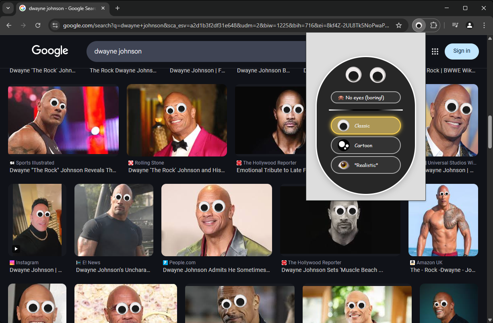

A super serious browser extension for Chromium browsers.

Choose from *three* available options of eyes to put on faces in your browser for a boost in productivity!

## About

When enabled, it will detect faces on images as they appear visible on screen. This includes sites with infinite scrolling. To save system resources, the extension will be dormant unless enabled on a per-tab basis.

This extension is powered by BlazeFace, provided as a pretrained model in Google's MediaPipe framework.

## Running the extension

Not yet available on the Chrome Web Store. You can manually install it with these steps:  
1. Download the source code
2. Go to the extensions page of your browser, e.g. chrome://extensions
3. Enable "Developer mode"
4. Press "Load unpacked"
5. Select the directory with the source code (containing manifest.json)

